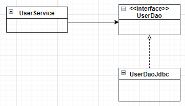

# 사용자 레벨 관리 기능 서비스 추상화

## 구현할 스펙
* 사용자 레벨은 BASIC, SILVER, GOLD 세 가지중 하나이다.
* 처음 가입하면 BASIC 레벨이 되며, 활동에 따라 한 단계씩 업그레이드가 된다.
    * 가입 후 50회 이상 로그인을 하면 BASIC 에서 SILVER 레벨이 된다.
    * SILVER 레벨이면서 30회 이상의 추천을 받으면 GOLD 레벨이 된다.
* 사용자 레벨의 변경 작업은 **일정한 주기를 가지고 일괄적으로 진행**된다.


## 사용자 레벨 추가
* 보통 사용자 레벨과 같이 일정 범위 안에서 구분되어 진다면 `ENUM`을 사용하는 것이 유리하다.
* `JPA` or `Hibernate`를 사용하면 Enum을 그대로 DB에 저장이 편하다.
* 이번 예제에서는 이 Enum을 int 를 저장하고, 겉으로는 Level를 래핑하자.
<br></br>
* `Level.enum` 참고
* 이후 당연히 `User.class`에 Level을 추가해야 한다.

## 사용자 레벨 업그레이드 조건 설정

### 로그인, 추천 생성
* `User.class` 도메인에 로그인 횟수와, 추천 횟수를 추가하자. `getter, setter` 추가도 잊지 말자.
  * 원래 `setter`은 막 추가하는 것을 권장하지 않는다. 하지만 연습에서는 편의를 위해서 `setter`를 추가하자.
<br></br>
* 이후 이전 장에 생성했던 `UserDaoJdbc`의 SQL 문에도 추가를 해 주어야 한다.
    * **`Level`은 `valueOf`를 통해 int 로 저장하는 것을 잊지 말자!**


### 레벨업 기능 생성
* 이 비즈니스 로직들은 어디에 만들어야 할까? **(관심사의 분리를 다시 떠올려 보자.)**
  * 우선 `UserDao`는 받은 데이터들을 DB에 저장하는데 집중을 하고 있다. 여기 넣는것은 좋은 선택이 아니다.
  * 그래서 비즈니스 로직 서비스를 제공하기 때문에 `service` 계층인 `UserService.class`를 생성하자.
* 이 `UserService`는 `userDao` 빈을 DI 받을 것이다. -> `UserService` 역시 빈으로 등록 해야 한다.
<br></br>

  
#### 신규 가입자 레벨 설정
* 처음 가입하면 BASIC 레벨이 된다.
  * 이제부터 신규가입은 `UserService`가 담당.
  ```java
  public void add(User user) {
      if (user.getLevel() == null) {
          user.setLevel(Level.BASIC);
          userDao.add(user);
      }
  }
  ```
#### upgradeLevels() 메소드 생성
* 우리가 구현할 레벨업 조건은 다음과 같다.
    * 가입 후 50회 이상 로그인을 하면 BASIC 에서 SILVER 레벨이 된다.
    * SILVER 레벨이면서 30회 이상의 추천을 받으면 GOLD 레벨이 된다.

```java
public void upgradeLevels(){
    List<User> users=userDao.getAll();
    for(User user:users){
        // 레벨업 조건
        if(user.getLevel() == Level.BASIC && user.getLogin() >= 50){
            user.setLevel(Level.SILVER);
            changed = true;
        } else if(user.getLevel() == Level.SILVER && user.getRecommend() >= 30){
            user.setLeve(Level.GOLD);
            changed = true;
        } else if(user.getLevel() == Level.GOLD) { changed = false; }
        else { changed = false; }
        // 레벨업 적용
        if (changed) { userDao.update(user); }
    } 
}
```

### 레벨업 기능 개선
* 각 메소드들을 생성은 하였으나 아직 부족한 부분들이 많다. 하나하나 개선해보자.

#### upgradeLevels() 로직의 분리
* 레벨업을 위해서는 두가지 조건을 만족해야 한다.
  * 다음 레벨이 있는가? (BASIC -> SILVER, SILVER -> GOLD)
  * 최소 로그인/추천 횟수를 넘겼는가?
* 여기서 조건들이 추가되면 될 수록 코드가 지저분하고, 복잡해 질 것이다.
<br></br>
* 이에 대한 해결책은 조건을 판별해줄 코드와, 판별된 결과로 레벨업을 해 주는 코드를 나누어야 한다.
  * 조건 판별 메소드 `canUpgradeLevel(user)`
  * 레벨업 메소드 `upgradeLevel(user)`

    
#### 조건 판별 메소드 `canUpgradeLevel(user)`
* 레벨업 기준을 만족하냐 안하냐로만 구분하기 때문에 복잡할 것 없이 `boolean` 타입을 사용하면 된다.
* `for`문을 써도 좋지만, 이렇게 케이스가 여러개인 경우에는 `Switch-case` 구문을 사용하는 것이 더 효율적이다.
  ```java
  boolean canUpgradeLevel(User user){
      Level currentLevel = user.getLevel();
      Switch(currentLevel){
          case BASIC: return (user.getLogin() >= 50);
          case SILVER: return (user.getRecommend >= 30);
          case GOLD: return false;
          default: throws new IllegalArgumentException("Unkonwn Level: "+ currentLevel);
      }
  }
  ```
* 마지막으로 default 값에 `IllegalArgumentException`을 던져 예외를 처리한다.
* 추가적으로 레벨업 조건들을 상수로 표현하면 더욱 깔끔한 코드를 구현할 수 있을 것이다.
  ```java
  public static final int MIN_LOGIN_COUNT_FOR_SILVER = 50;
  public static final int MIN_RECOMMEND_FOR_GOLD = 30;
  ```

#### 레벨업 메소드 `upgradeLevel(user)`
* 조건 판별 메소드의 결과를 바탕으로 `true`면 실행하고, `false`면 실행을 하지 않으면 된다.
  ```java
  void upgradeLevel(User user){
      if(user.getLevel() == Level.BASIC) user.setLevel(Level.SILVER);
      else if(user.getLevel() == Level.SILVER) user.setLevel(Level.GOLD);
      userdao.update(user);
  }
  ```
* 충분히 괜찮은 코드이지만 여기서도 개선점이 있다.
  * 중간에 새로운 `Level`이 생성되는 경우에 수정할 부분이 많아진다.
  * 최고 단계인 `GOLD`일 경우에 대한 예외처리가 없다.
* 차라리 다음 레벨에 대한 정보를 `Level` Enum 자체에 부여하면 더 편하지 않을까?

#### Level Enum 수정
* Enum 선언에 다음 단계의 레벨 정보도 추가하자 (`private final Level next;`)  
  `GOLD(3, null), SILVER(2, GOLD), BASIC(1, SILVER);`
* 추가적으로 `생성자`를 수정하고 `getter` 메소드를 생성해야 한다.

#### upgradeLevel() 생성
* 이 메소드의 위치는 어디가 좋을까?
  * `User`의 내부 정보가 변경되는 것은 `UserService` 보다는 `User`가 스스로 다루는게 적절하다.
  * `UserService`가 일일이 레벨 업그레이드 시 **`User`의 어떤 필드를 수정한다는 로직을 갖기보다는, 
    `User`에게 정보 변경을 요청하는것이 낫다.**
  * 객체지향의 핵심은 **외부에서 정보를 가지고 와서 작업하기보다는, 정보를 가지고 있는 클래스에게 요청하는 것으로 설계를 해야는 것**이다.
    * `User`은 `Level`에게 **다음 레벨이 무엇인지 요청을 하고 있다.**
    ```java
    public void upgradeLevel() {
      Level nextLevel = this.level.nextLevel();
      if (nextLevel == null) {
        throw new IllegalStateException(this.level + "은  업그레이드가 불가능합니다");
      }
      else { this.level = nextLevel; }
    }
    ```
* 최종적인 `UserService`의 `upgradeLevel()`이다.
  * `User`에게 레벨 업그레이드를 요청을 하고, `UserDao` 에게 DB에 업데이트를 요청한다.
    ```java
    public void upgradeLevel(User user) {
        user.upgradeLevel();
        userDao.update(user);
    }
    ```