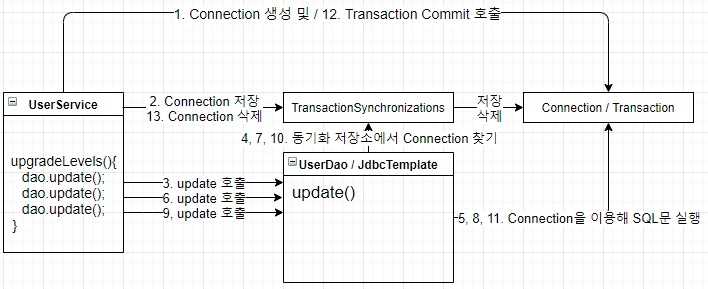
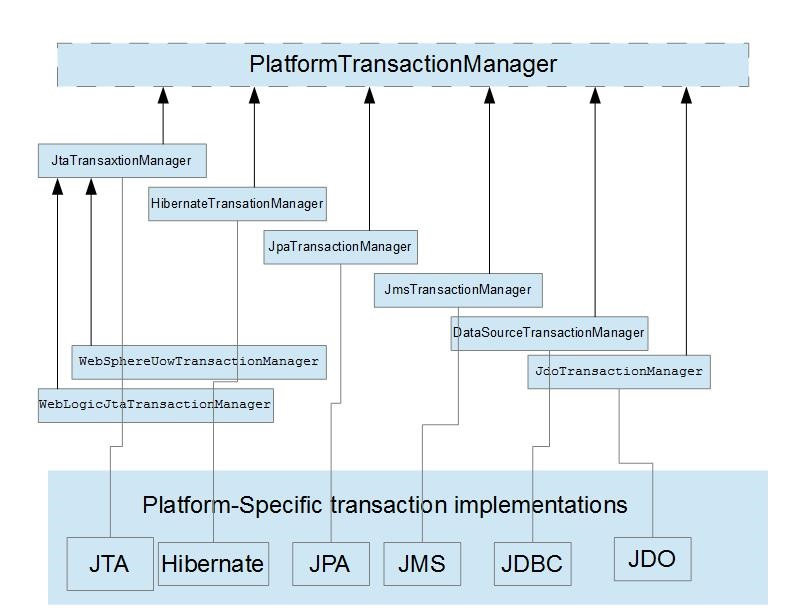

# 트랜잭션 서비스
* 실제로 이 서비스를 배포한다고 하자, 아직 개선해야할 점이 있다.
    * 레벨 관리 작업 중 네트워크가 끊기거나, 서버에 이상이 생겨 작업이 도중에 끊기게 된다면 변경된 레벨을 그대로 둘까? 롤백을 할까?
    * 롤백을 가정하고 테스트를 실시해 보자.
    

## 트랜잭션 경계 설정
* 기본적으로 DB는 트랜잭션을 지원한다.
  * 다중 로우의 수정이나 삭제를 위한 요청이 왔을 때 일부 로우만 삭제되고 나머지는 안되거나 하는 경우는 없다.
  * 그렇기 때문에 하나의 SQL 명령을 처리하는 경우에는 DB가 트랜잭션을 보장해준다고 믿을 수 있다.
  
* 하지만 여러 개의 SQL문이 사용되는 로직이면 말이 달라진다.
  * 이런 경우 여러 SQL문을 하나의 트랜잭션으로 묶어야 한다.
  
* 예를 들어 일괄적으로 등급을 업그레이드 시켜주는 `upgradeLevels()`를 보자.
  ```java
  public void upgradeLevels() throws SQLException{
      List<User> users=userDao.getAll();
      =============== 우리가 원하는 트랜젝션 시작 ===============
      for(User user:users){
          if(canUpgradeLevel(user)){
              // 실제 Transaction 시작
              upgradeLevel(user);   // userDao.update() sql 사용
              // 실제 Transaction 종료
          }
      }
      =============== 우리가 원하는 트랜젝션 끝 ===============
  }
  ```
* 우리가 원하는 트랜잭션의 범위는 `for문` 전체일 것이다. 하지만 실제론 트랜잭션의 경계범위가 SQL 문 하나 하나 이기 때문에,  
  도중에 장애가 발생하게 된다면, 해당 SQL문을 기준으로 앞의 `user`들은 업데이트가 실시되고, 뒤의 `user`들은 업데이트가 실시되지 않을 것이다.
  
* 그렇기 때문에 무엇보다도 트랜잭션 경계를 넓혀주어야 한다.

### JDBC 경계설정
* JDBC의 경계설정은 다음과 같이 이루어 진다.
  ```java
  public void upgradeLevels() throws SQLException{
      1. DB Connection 생성
      2. 트랜잭션 시작
      try{
        3. DAO 메소드 호출
        4. 트랜잭션 커밋      
      } catch(Exception e){
            5. 트랜잭션 롤백
      } finally{
            DB Connection 종료
      }
  }
  ```
* 일반적인 JDBC의 트랜잭션 경계 설정은 `DB Connection` 정보를 필요로 하는데, 이렇게되면 문제점이 생긴다.
  * **JDBCTemplate 를 사용하지 못함.**
    * 1~4 장까지 해왔던 것들을 모두 롤백시켜야 한다.
  * **`UserService`의 모든 메소드에 `Connection`을 파라미터로 가지고 있어야 한다.**
    * `UserService`는 스프링 빈으로 선언되어 있어 싱글톤인 상태이다. 고로 인스턴스 변수에도 저장할 수 없다.
    * 그렇기 때문에 항상 `Connection` 파라미터로 받는 방법밖에 없다.
  * **독립적이지 못한 `UserDao`**
    * `JDBC`가 아닌 `JPA`와 `Hibernate`로 `UserDao`의 구현을 변경하려 한다면, `Connection`에서 `EntityManager`나 `Session` 오브젝트를 사용해야 하는데
    * 이 경우에는 `UserDao`와 `UserService`를 각각에 맞게 수정을 해야 한다.
  * 
  

#### 문제 해결 1단계 (TransactionSynchronizations)
* 일단 두번째 문제인 `Connection`을 파라미터로 가지고 있어야하는 것을 해결해보자.
* 스프링은 **트랜잭션 동기화** 방식을 통해서 이를 해결하도록 권장하고 있다.
* 트랜잭션 동기화란 `Connection` 오브젝트를 특별한 저장소에 보관한 뒤, 호출되는 `DAO 메소드`에서 저장된 `Connection`을 가져다가 사용하게 하는 것이다.

* 다음은 트랜잭션 동기화의 대략적인 흐름이다.  

```java
    public void upgradeLevels() throws SQLException {
        // 동기화 작업 초기화
        TransactionSynchronizationManager.initSynchronization();
        
        // DB 커넥션 생성, 트랜잭션 시작.
        Connection c = DataSourceUtils.getConnection(dataSource);
        // false를 해 두어야 SQL문이 각각 실행될때마다 commit 이 안된다.
        c.setAutoCommit(false)

        try {
            List<User> users = userDao.getAll();
            for (User user : users) {
                if (canUpgradeLevel(user)) {
                    upgradeLevel(user);
                }
            }
        // 정상적으로 작업을 마치면 commit
            c.commit();
        } catch (Exception e) {
        // 오류 발생시 rollback
            c.rollback;
            throw e;
        } finally {
            // DB 커넥션 닫기  [connection.close() 역할]
            DataSourceUtils.releaseConnection(c, dataSource);
            // 동기화 작업 종료 및 정리
            TransactionSynchronizationManager.unbindResource(this.dataSource);
            TransactionSynchronizationManager.clearSynchronization();
        }
    }
```

#### 문제 해결 2단계 (Transaction 추상화)
* 1단계에서는 JDBC 한정으로 최선을 다한 코드이다.
* 그 말은 `JDBC`에 종속적인 코드라는 말이다. (OCP 위반)
  이제부터는 `JDBC`에 구애받지 않고 `JPA`나 `Hibernate`에도 가능하게 하는 추상화를 할 차례이다.
  
* 스프링은 Transaction 추상화를 위해 `PlatformTransactionManager` 인터페이스를 제공하고 있다.

  * 출처 : https://stackoverflow.com/questions/9034101/how-to-get-transactionmanager-reference-in-spring-programmatic-transaction
  
* 현재는 `JDBC`를 이용하고 있기 때문에 `DataSourceTransactionManager`을 사용하면 된다.

```java
public void upgradeLevels() throws SQLException{
    PlatformTransactionManager transactionManger = new DataSourceTransactionManager(datasource);

    TransactionStatus status
        = transactionManager.getTransaction(new DefaultTransactionDefinition());
    try{
        List<User> users=userDao.getAll();
        for(User user:users){
            if(canUpgradeLevel(user)){
                upgradeLevel(user);
            }
        }
        transactionManager.commit(status);
    }catch(Exception e){
        this.transactionManager.rollback(status);
        throw e;
    }
}
```
* 이제 어떠한 방식을 사용하더라도 초기화를 제외한 코드가 변할 일은 없다.
* 여기서 추가적으로 빈으로 등록해서 DI도 실시해보자.
  * 그 전에 이 클래스가 싱글톤으로 만들어져 여러 스레드에서 동시에 사용해도 괜찮은지를 파악하는 것도 잊지말자.
* `UserService.class` 추가
  ```java
  private PlatformTransactionManager transactionManager;
  
  //DataSource DI
  public void setTransactionManager(PlatformTransactionManager transactionManager) {
      this.transactionManager = transactionManager;
  }
  
  // transactionManager -> this.transactionManager 로 변경
  ```
* 설정파일도 그에 맞게 변화를 주면 된다.


#### @Transactional
* 스프링이 발전해가면서 이러한 작업들을 한번에 단축해주는 어노테이션이 생겼다
* `@Transactional`을 필요한 메소드 위에 입력해주면 된다.

